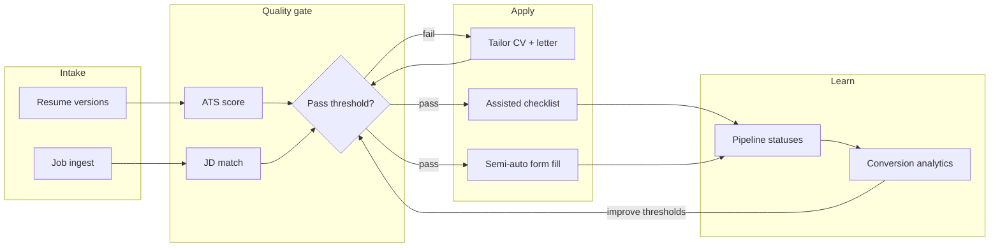

# Premium Job Tracker, Matcher & Applier

## Product thesis

This is **not** a generic application tracker. It is a **conversion engine**: every feature exists to raise **apply → response → interview** rate by blocking weak applications and forcing recruiter-grade tailoring before submit.

Tone: professional software developer + international recruiter workstation. Reports, scores, checklists, pipelines — **no chat bot UI**. LLMs run under the hood for scoring, gap analysis, and letter drafting only.



## Locked decisions

| Decision | Choice |
|----------|--------|
| Apply modes | **Assisted** + **Semi-auto** (no full silent auto-submit) |
| Users | Multi-user SaaS (accounts, cloud DB) |
| Markets | Thailand, Malaysia, Singapore + worldwide remote |
| AI | Under the hood only; UI is reports / editors / scores |
| Monetization | Stripe subscriptions (Free trial / Pro) — Pro unlocks semi-auto, unlimited tailor, market intel |
| Stack | **Next.js 15 (App Router) + TypeScript + Tailwind + Prisma + SQLite→Postgres (Supabase) + Auth.js (credentials + Google) + OpenAI/Anthropic API + Stripe** |

## Premium differentiators (interview ratio)

1. **Quality gate before apply** — hard block or strong warning when ATS + JD match are below configurable thresholds (default: ATS ≥ 75, match ≥ 70).
2. **JD-specific resume variants** — clone base CV → keyword/gap rewrite suggestions → diff view → export PDF/DOCX.
3. **Recruiter critique panel** — structured findings (missing metrics, vague verbs, seniority mismatch, location/visa risk for TH/MY/SG), not free-form chat.
4. **Cover letter studio** — 3 recruiter templates (direct, narrative, technical) + company/role tokens; editable before export.
5. **Job worthiness score** — salary band, remote policy, seniority fit, spam/repost heuristics so users do not spray-and-pray.
6. **Conversion cockpit** — funnels by market, role family, match band; surface "what got interviews."
7. **Semi-auto apply** — browser extension guided fill for common fields; user confirms submit (ToS-safe).

---

## Phase 1 — Core SaaS + conversion loop ✅ DONE

- Auth, profiles, billing stubs
- Resume library (upload PDF/DOCX → parse → structured profile)
- ATS score engine (parseability, keywords, sections, contact, formatting flags) + score breakdown UI
- Job inbox (manual URL/paste JD + saved searches metadata for TH/MY/SG/remote)
- Match report (skills overlap, missing must-haves, seniority, location)
- Quality gate + apply checklist (Assisted mode)
- Cover letter generator + editor
- Pipeline Kanban: Saved → Tailoring → Ready → Applied → Screening → Interview → Offer / Rejected
- Basic conversion dashboard

---

## Phase 2 — Semi-auto + market intel ✅ DONE

- Chrome extension (Manifest V3): detect job page → scrape JD → push to app via API token
- Site-specific scrapers: LinkedIn, JobStreet, JobsDB, Indeed, Seek, Glassdoor + generic fallback
- Extension popup: dark theme, job preview, market selector, settings panel
- Extension token management in Settings (generate / revoke / one-time reveal)
- Market Trend Briefs in Insights: TH / MY / SG / Remote — skills demand, salary ranges, remote %, hot roles

---

## Phase 3 — Scale & productionise 🔲 NEXT

> **Goal**: Turn the local dev prototype into a production SaaS that real users can sign up to and pay for.

### 3a. Deploy to production
- Migrate Prisma from SQLite → **Supabase Postgres**
- Deploy Next.js on **Vercel**; set env vars (`DATABASE_URL`, `NEXTAUTH_SECRET`, `OPENAI_API_KEY`, Stripe keys)
- Supabase Storage for CV file uploads (replace local/memory approach)
- Custom domain + SSL

### 3b. Real Stripe billing
- Stripe Checkout session for PRO upgrade
- Webhook: `checkout.session.completed` → `user.plan = "PRO"`, store `stripeCustomerId`
- Customer portal (manage subscription / cancel)
- Stripe integration already stubbed in Settings — just needs wiring

### 3c. Multi-resume targeting + A/B outcome tracking
- Tag resumes with role family: Backend / Fullstack / Data / DevOps / Mobile
- Job detail workbench auto-suggests the best-fit resume variant based on JD keywords
- Track which variant (by title/family) is associated with interviews vs rejections
- Surface in Insights: "Backend variant — 28% interview rate vs 11% for Fullstack variant"

### 3d. Follow-up email reminders
- After status → APPLIED, start a 7-day countdown
- Cron (Vercel Cron / Inngest) sends reminder email: "No response in 7 days — follow up now"
- User can dismiss per-application or set custom reminder interval in settings
- Requires: email provider (Resend / SendGrid)

### 3e. Public shareable match reports
- Generate a signed `/report/[nanoid]` URL for any match report
- Recipient sees read-only: match score, skills overlap, cover letter (optional)
- Useful for: sharing with a referral, portfolio, or recruiter
- Expires after 30 days

### 3f. Google OAuth
- Add Google provider to Auth.js alongside credentials
- Auto-populate name, email, avatar from Google profile on first sign-in
- No password required for Google users

### 3g. Admin & usage metering
- Admin-only dashboard: total users, applications/day, API call counts
- Per-user rate limits (OpenAI calls, match runs) to prevent abuse on Free plan
- Usage analytics (which features are used most)

---

## Phase 4 — Growth & expansion 🔲 FUTURE

> **Goal**: Expand the product surface and grow the user base.

### 4a. Team & recruiter collaboration
- Shared pipeline view for job-seekers working with a career coach / recruiter
- Recruiter can leave structured notes per application
- Role-based access: Owner / Collaborator / View-only

### 4b. Saved search job alerts
- User saves a search query (title + market + skills filter)
- Daily email digest when new JDs on integrated boards match the profile
- Requires job board API integrations (LinkedIn, JobStreet) or periodic scraping

### 4c. Progressive Web App (mobile)
- Service worker + web manifest for installable PWA
- Offline resume view + pipeline status update
- Push notifications for interview reminders

### 4d. Public candidate profile (opt-in)
- `/u/[username]` — shareable profile page
- Shows: skills, ATS-ready resume summary, target markets
- Recruiter inbound: "Let recruiters find you" toggle
- Privacy: completely opt-in, no PII exposed without consent

### 4e. Official job board integrations
- LinkedIn Jobs API (where quota available) for 1-click job import
- JobStreet API for TH/MY/SG market automation
- Reduces friction vs manual paste / extension

---

## Architecture

```
apps/web          Next.js SaaS UI + API routes
packages/scoring  Deterministic ATS heuristics + LLM enrichment layer
packages/matching JD↔resume scorer
extension/        Chrome extension (Phase 2 ✅)
```

- DB: Supabase Postgres via Prisma (SQLite for local dev)
- File storage: Supabase Storage for CV uploads
- Jobs API routes for score/match/letter; queue (Inngest or Vercel Cron) for heavy parse
- Secrets: `OPENAI_API_KEY` / `ANTHROPIC_API_KEY`, Stripe, Supabase — never client-exposed

## Scoring approach (premium, explainable)

1. **Deterministic layer** (always runs): section presence, contact, keyword density vs JD, file type/layout risks, bullet quality heuristics.
2. **LLM enrichment** (server-side): seniority fit narrative, rewrite suggestions, cover letter draft — returned as structured JSON into UI cards.
3. User always sees **why** the score moved; every apply stores score snapshot for learning.

## Semi-auto policy

- Never submit without explicit user click.
- Extension only fills fields from approved profile + selected variant.
- Log every fill event for audit.
- Prefer official "Easy Apply"-style pages and generic HTML forms; document unsupported sites.

## Delivery order (full roadmap)

1. ✅ Scaffold monorepo, auth, Prisma schema, design system shell
2. ✅ Resume upload/parse + ATS report UI
3. ✅ Job create + match report + quality gate
4. ✅ Cover letter studio + Assisted apply checklist + pipeline
5. ✅ Stripe Pro gating (stub) + conversion dashboard
6. ✅ Chrome extension + market trend briefs
7. 🔲 Production deploy (Supabase + Vercel)
8. 🔲 Real Stripe billing
9. 🔲 Multi-resume targeting + A/B outcome tracking
10. 🔲 Follow-up reminders + shareable reports + Google OAuth
11. 🔲 Admin metering
12. 🔲 Team collaboration + job alerts + PWA + public profile

## Success metrics (product)

- % applications that pass quality gate
- Interview rate by match-score band
- Median time Saved → Applied
- Letter/resume revision count before apply
- MRR (monthly recurring revenue) from PRO conversions

Target product claim: users apply **fewer, higher-fit** roles and see higher interview rate vs spray-and-pray trackers.

## Out of scope (all phases)

- Silent full auto-apply across LinkedIn/Jobstreet without user confirmation
- Guaranteed interview promises
- Mobile-native apps (responsive web + PWA first)
